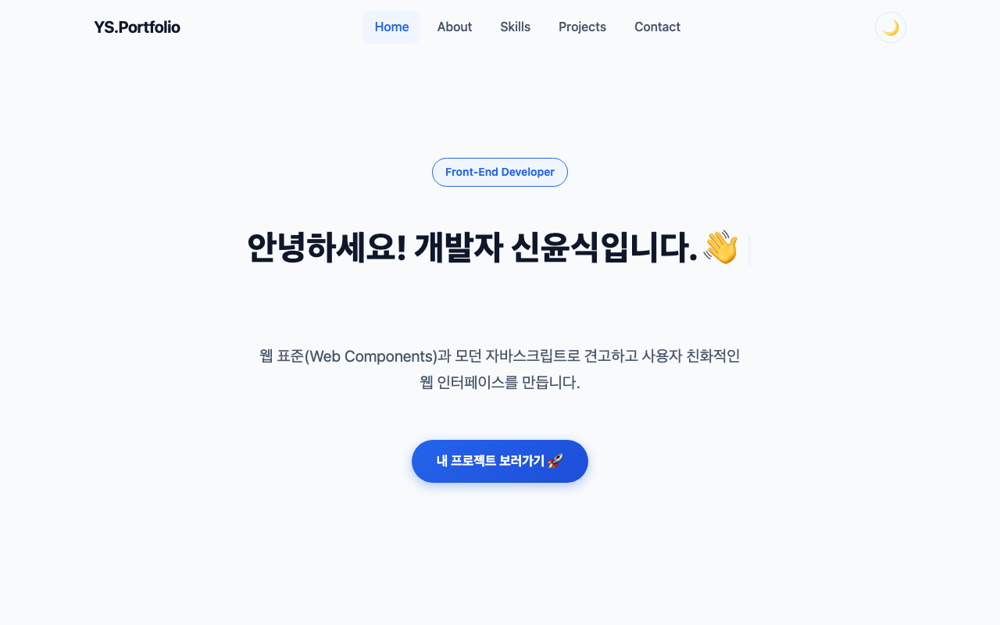
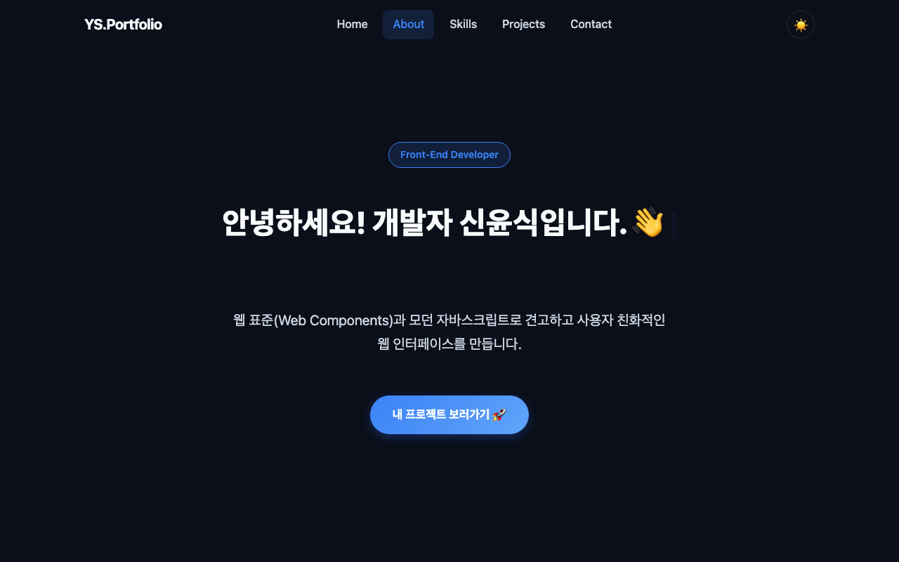
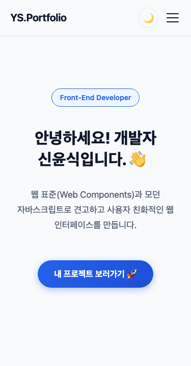
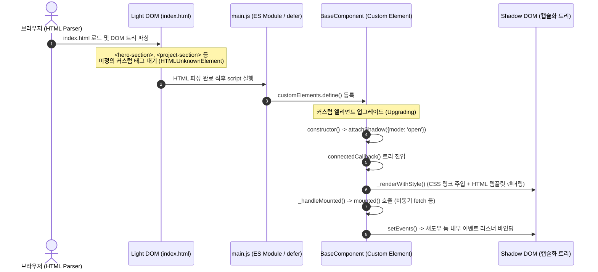
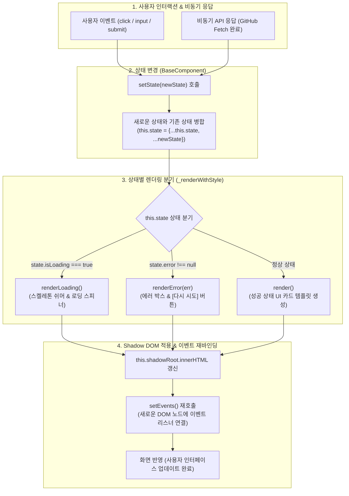

# 🚀 바닐라 자바스크립트 반응형 포트폴리오 웹사이트

외부 라이브러리(React, Vue, jQuery 등) 없이 **순수 HTML5, CSS3, 모던 JavaScript(ES6+) 및 웹 표준 Web Components(Custom Elements & Shadow DOM)**만을 사용하여 구축한 반응형 포트폴리오 웹사이트입니다.

"사용자 이벤트 → 상태 변경 → DOM 업데이트"로 이어지는 프론트엔드 핵심 렌더링 파이프라인을 직접 체득하고, GitHub REST API 연동을 통해 로딩/성공/에러/빈 상태의 비동기 UI를 구현했습니다.

---

## 🌐 1. 배포 및 저장소 정보

- **배포 사이트 URL (GitHub Pages)**: [https://yoonsik-shin.github.io/codyssey-mission/B1/1/](https://yoonsik-shin.github.io/codyssey-mission/B1/1/)
- **GitHub 저장소 URL**: [https://github.com/Yoonsik-Shin/codyssey-mission](https://github.com/Yoonsik-Shin/codyssey-mission)

---

## 📸 2. 프로젝트 스크린샷

| 1. 데스크톱 라이트 모드 | 2. 데스크톱 다크 모드 |
| :---: | :---: |
|  |  |

| 3. 모바일 반응형 화면 |
| :---: |
|  |

---

## 📁 3. 프로젝트 폴더 구조 (Directory Structure)

본 프로젝트는 순수 웹 표준에 따라 역할별로 디렉토리를 분리했습니다:

```text
B1/1/
├── index.html                  # 애플리케이션 진입점 및 시맨틱 레이아웃
├── css/
│   ├── style.css               # 전역 CSS 변수(:root, 다크모드), 리셋, 헤더/네비게이션
│   └── components/             # 컴포넌트별 캡슐화 스타일시트
│       ├── AboutSection.css
│       ├── BaseComponent.css   # 스켈레톤, 스피너, 에러 박스 공통 테마 스타일
│       ├── ContactSection.css
│       ├── HeroSection.css
│       ├── ProjectsSection.css # Grid 카드 레이아웃 및 필터 버튼
│       └── SkillsSection.css
├── js/
│   ├── main.js                 # 스크립트 진입점 (테마, 햄버거, 스크롤 인터랙션)
│   └── components/             # Web Components (Custom Elements)
│       ├── AboutSection.js
│       ├── BaseComponent.js    # 상태 관리(setState) 및 수명주기 베이스 클래스
│       ├── ContactSection.js   # 폼 유효성 검증 및 Formspree 이메일 전송
│       ├── HeroSection.js      # 타자기 애니메이션
│       ├── ProjectsSection.js  # GitHub REST API 연동, 4대 상태 렌더링
│       └── SkillsSection.js
├── images/                     # 이미지 에셋 및 평가용 스크린샷
│   ├── profile.jpg             # 프로필 이미지
│   ├── screenshot-desktop.png  # 데스크톱 라이트 모드 캡처
│   ├── screenshot-darkmode.png # 데스크톱 다크 모드 캡처
│   └── screenshot-mobile.png   # 모바일 반응형 캡처
└── docs/                       # 상세 아키텍처 및 심화 학습 가이드 (5종)
```

---

## 🛠️ 4. 기술 스택 (Tech Stack)

- **언어 및 표준**: HTML5 (시맨틱 마크업), CSS3 (CSS Variables, Flexbox, Grid), Modern JavaScript (ES6+ Modules)
- **컴포넌트 아키텍처**: Web Components (`Custom Elements`, `Shadow DOM`, `BaseComponent`)
- **브라우저 API**: `IntersectionObserver` (스크롤 애니메이션), `matchMedia` (OS 다크모드 감지), `Fetch API` (비동기 통신), `localStorage` & `sessionStorage` (영속성 및 캐싱)
- **배포 환경**: GitHub Pages (정적 호스팅)

---

## 🔄 5. 화면 렌더링 파이프라인 및 상태 관리 (Architecture)

본 프로젝트는 외부 프레임워크(React 등) 없이 **브라우저 네이티브 Web Components와 `BaseComponent` 기반의 단방향 데이터 흐름(Unidirectional Data Flow)**으로 화면을 렌더링합니다.

### 💡 전역 상태(Global State) vs 컴포넌트 로컬 상태(Local State) 분리 기준

| 구분 | 관리 위치 | 대상 데이터 | 렌더링 전파 방식 |
| :--- | :--- | :--- | :--- |
| **전역 상태 (Global)** | `html[data-theme]` & `localStorage` | 다크/라이트 테마 설정 | 부모 DOM의 속성 변경이 CSS 변수를 통해 Shadow DOM 내부로 자동 상속 및 일괄 반영 |
| **컴포넌트 로컬 상태 (Local)** | 각 컴포넌트 인스턴스의 `this.state` | 로딩(`isLoading`), 에러(`error`), 데이터(`repos`, `formData`) | `this.setState(newState)` 호출 시 해당 컴포넌트의 Shadow DOM만 국소 재렌더링 |

### 1) 초기 마운트 및 업그레이드(Upgrade) 흐름



---

### 2) 이벤트 발생 시 상태 변경 및 재렌더링 파이프라인 (State-Driven Pipeline)



### 💡 브라우저 콘솔(F12)에서 비동기 상태 직접 검증해보기

실제 배포 사이트에서 개발자 도구(`F12`) 콘솔을 열고 아래 명령어를 입력하여 각 UI 상태를 즉시 확인할 수 있습니다:

```javascript
// 1. 로딩 상태 보기 (스켈레톤 반짝임 UI)
document.querySelector('project-section').setState({ isLoading: true });
// 👉 6개의 프로젝트 카드 자리에 반짝반짝 빛이 흐르는(Shimmer) 스켈레톤 카드가 나타납니다.

// 2. 에러 상태 보기 (경고 아이콘 + '다시 시도' 버튼 UI)
document.querySelector('project-section').setState({ 
  isLoading: false, 
  error: new Error("네트워크 연결이 끊어졌습니다. (테스트 에러)") 
});
// 👉 노란 경고 아이콘(⚠️), 에러 메시지, 그리고 [다시 시도] 버튼이 화면에 렌더링됩니다.
// ([다시 시도] 버튼을 클릭하면 세션 캐시를 비우고 다시 정상 데이터를 가져옵니다.)

// 3. 빈 상태(Empty State) 보기 ("표시할 프로젝트가 없습니다")
document.querySelector('project-section').setState({ 
  isLoading: false, 
  error: null, 
  repos: [] 
});
// 👉 폴더 아이콘(📂)과 함께 "표시할 프로젝트가 없습니다."라는 안내 박스가 뜹니다.

// 4. 정상 상태로 복구하기
const p = document.querySelector('project-section');
p._isMounted = false;
p.connectedCallback();
// (또는 브라우저 새로고침 F5)
```

---

## ✨ 6. 주요 기능 및 인터랙션

1. **모바일 퍼스트 반응형 레이아웃**:
   - 뷰포트에 따른 유연한 그리드 레이아웃 (모바일 `< 768px`, 태블릿 `768px ~ 1023px`, 데스크톱 `≥ 1024px`)
   - 모바일 환경 전용 햄버거 토글 메뉴 및 네비게이션 드로어

   | 뷰포트 너비 | 기기 분류 | 레이아웃 및 UI 주요 특징 |
   | :--- | :--- | :--- |
   | **`< 768px`** | 모바일 (기본) | • 네비게이션 숨김 및 햄버거 버튼 노출<br>• Hero / About / Contact 1열 세로 배치<br>• Projects / Skills 카드 1열 배치 |
   | **`768px ~ 1023px`** | 태블릿 | • 햄버거 버튼 숨김 및 가로 네비게이션 바 노출<br>• About 본문 및 프로필 2열 배치 (`flex-direction: row`)<br>• Projects 카드 2열 그리드 배치 |
   | **`≥ 1024px`** | 데스크톱 | • 최대 너비(`1080px`) 중앙 정렬 및 여백 확보<br>• Projects 카드 3열 그리드 자동 확장<br>• 풍부한 마우스 Hover 마이크로 인터랙션 활성화 |

2. **다크 모드 시스템**:
   - `prefers-color-scheme` OS 시스템 테마 자동 감지 및 실시간 변경 리스너
   - `localStorage` 테마 영속성(새로고침 후에도 유지)
3. **Hero 섹션 타자기 애니메이션**:
   - 한 글자씩 타이핑 및 백스페이스 효과를 반복하는 Typewriter Effect (언마운트 시 메모리 누수 방지 타이머 해제)
4. **GitHub API 동적 연동 및 다중 상태 UI (Projects)**:
   - 본인 저장소 목록 동적 렌더링 (`stargazers_count`, 주 언어, 설명 등)
   - **4가지 상태 표현**: 로딩(스켈레톤 쉬머/스피너), 성공(카드 그리드), 에러(403 레이트 리밋 방어 및 [다시 시도] 버튼), 빈 상태
   - `sessionStorage` 5분 만료 캐시 패턴 적용으로 불필요한 API 호출 방지
   - 저장소 주 언어별 동적 필터링 버튼 (`map`, `filter` 활용)
5. **Contact 폼 실시간 유효성 검증 & 실제 이메일 전송 (Formspree 연동)**:
   - `event.preventDefault()` 기반 폼 제출 인터셉트
   - 필수 입력값 검증, 이메일 정규표현식 검증, 실시간 입력 에러 클리어
   - **Formspree API(`https://formspree.io/f/myezyrkk`) 연동으로 실제 사용자 문의 이메일 발송 (보너스 과제 달성)**
   - 제출 성공 시 인터랙티브 성공 피드백 카드 노출 및 폼 재작성 지원
6. **스크롤 효과 & 접근성**:
   - 60px 이상 스크롤 시 글래스모피즘(블러) 헤더 스타일 전환
   - 300px 이상 스크롤 시 플로팅 상단 이동(Scroll To Top) 버튼 노출
   - `IntersectionObserver` 기반 뷰포트 진입 페이드인 애니메이션 (`threshold: 0.25`)
   - `for`-`id` 라벨 1:1 매칭, 스크린 리더용 `alt` 속성 완비
7. **스크립트 로딩 최적화**:
   - `<script type="module" defer src="./js/main.js"></script>`로 파서 블로킹 방지 및 DOM 완성 후 안전한 초기화 보장

---

## 📚 6. 상세 아키텍처 및 학습 문서

프로젝트 구현 상세 원리와 심화 학습 내용은 `docs/` 폴더 내 문서에 정리되어 있습니다:

- [1. 웹 컴포넌트 아키텍처 및 상태 관리](./docs/01_Web_Components.md)
- [2. 시맨틱 HTML 마크업과 웹 접근성](./docs/02_Semantic_HTML.md)
- [3. 모바일 퍼스트 CSS와 테마 시스템](./docs/03_CSS_and_Theming.md)
- [4. JavaScript 및 브라우저 API (스크립트 defer 전략 포함)](./docs/04_Browser_APIs_and_JS.md)
- [5. 요구사항 구현 체크리스트 (25개 항목 100% 달성)](./docs/05_Requirements_Checklist.md)

---

## 📋 7. 요구사항 검증 요약

<details>
<summary><b>과제 요구사항 전체 체크리스트 펼쳐보기</b></summary>

| 번호 | 요구사항 | 구현 내용 및 세부 사항 | 상태 |
| :--- | :--- | :--- | :---: |
| **1** | **반응형 웹 (모바일 퍼스트)** | 모바일 퍼스트 기준 미디어 쿼리 (`768px`, `1024px`), 햄버거 메뉴 토글 | ✅ |
| **2** | **필수 섹션 포함** | Hero, About, Skills, Projects, Contact, Footer 6개 섹션 완비 | ✅ |
| **3** | **다크모드 토글** | 시스템 다크 모드 감지 (`prefers-color-scheme`) 및 토글 버튼 | ✅ |
| **4** | **햄버거 메뉴** | 모바일 전용 토글 버튼 및 메뉴 항목 클릭 시 자동 닫힘 | ✅ |
| **5** | **부드러운 스크롤** | `scroll-behavior: smooth`, Intersection Observer 기반 활성 메뉴 연동 | ✅ |
| **6** | **스크롤 애니메이션** | Intersection Observer (`threshold: 0.25`) 뷰포트 감지 페이드인 | ✅ |
| **7** | **Form 유효성 검사** | 필수값, 이메일 정규식, 실시간 에러 표시, 제출 성공 피드백 | ✅ |
| **8** | **GitHub API 동적 연동** | `fetch`, `async/await`, Rate Limit(403) 예외 처리, 5분 세션 캐싱 | ✅ |
| **9** | **UI 4가지 상태 표현** | 로딩(스켈레톤/스피너), 성공, 에러(재시도 버튼), 빈 상태 | ✅ |
| **10** | **테마 로컬스토리지 저장** | 새로고침 후에도 사용자 테마 설정 영구 유지 | ✅ |
| **11** | **GitHub Pages 배포** | [배포 URL](https://yoonsik-shin.github.io/codyssey-mission/B1/1/)에서 모든 기능 정상 동작 | ✅ |
| **12** | **최소 폴더 구조 & 스타일 규칙** | `index.html`, `css/`, `js/`, `images/` 분리, `defer` 명시, `:root` 변수 | ✅ |
| **13** | **Live Server 개발 환경** | VS Code Live Server 등 정적 서버 환경 완벽 지원 | ✅ |
| **14** | **시맨틱 태그 활용** | `<header>`, `<nav>`, `<main>`, `<section>`, `<article>`, `<footer>` 적용 | ✅ |
| **15** | **네비게이션 배경 전환** | 스크롤 60px 초과 시 헤더 배경 블러 및 테두리 효과 | ✅ |
| **16** | **이미지 alt 속성** | 모든 이미지 태그에 설명적인 `alt` 속성 기재 | ✅ |
| **17** | **폼 접근성 & 기본 동작 방지** | `<label for="...">` 매칭 및 `event.preventDefault()` 기본 동작 차단 | ✅ |
| **18** | **호버 및 트랜지션** | 버튼/카드 `hover` 가상 클래스 및 `transition` 애니메이션 | ✅ |
| **19** | **카드 그림자** | 일관된 `box-shadow` 및 호버 시 깊이감 전환 | ✅ |
| **20** | **스크롤 탑 버튼** | 스크롤 300px 초과 시 플로팅 버튼 노출 및 상단 부드러운 이동 | ✅ |
| **21** | **화살표 함수 활용** | 전반적인 콜백 함수 및 내부 메서드에 ES6 화살표 함수 적용 | ✅ |
| **22** | **템플릿 리터럴 활용** | 백틱(`` ` ``)을 이용한 동적 HTML 마크업 렌더링 | ✅ |
| **23** | **구조분해 할당 활용** | 상태 객체 및 파라미터 구조분해 할당 적용 | ✅ |
| **24** | **배열 메서드 활용** | `map`(카드 렌더링), `filter`(언어별 필터), `forEach`(DOM 이벤트 순회) | ✅ |
| **25** | **인라인 스타일 배제** | 모든 스타일을 외부 CSS 파일로 완벽히 분리 | ✅ |

</details>

---

## 🎯 8. 설명 가능한 학습 목표

- **시맨틱 태그 설계 기준**: 단순한 구역 분할(`div`)을 지양하고, 문서의 의미론적 계층 구조(헤더, 네비게이션, 본문 구역, 독립적인 카드 아티클, 푸터)를 명확히 설계하여 웹 접근성(A11y)과 검색 엔진 최적화(SEO)를 달성한 기준을 설명할 수 있습니다.
- **Flexbox vs Grid 차이와 선택 기준**: 1차원 흐름 배치(네비게이션 바, 폼 입력 줄바꿈)에는 `Flexbox`를, 2차원 반응형 그리드(`repeat(auto-fit, minmax(...))` 기반의 프로젝트 카드 배치)에는 `Grid`를 적용한 설계 기준을 설명할 수 있습니다.
- **DOM 탐색과 이벤트 리스너 흐름**: 인라인 이벤트 핸들러 대신 `querySelector`로 타겟을 명확히 지정하고 `addEventListener`를 통해 관심사를 분리하는 바닐라 자바스크립트 이벤트 위임 및 바인딩 흐름을 설명할 수 있습니다.
- **모던 JS 문법과 배열 고차 함수**: 가독성을 높이는 화살표 함수, 불필요한 중복을 줄이는 구조분해 할당, 그리고 원본 데이터를 변경하지 않고 선언적으로 변환/선별하는 `map`, `filter`, `forEach`의 동작 원리를 설명할 수 있습니다.
- **비동기 API와 상태별 UI 피드백**: `fetch`와 `async/await`를 통해 비동기 데이터를 가져오며, 네트워크 지연(로딩), 호출 한도 초과(403 에러 및 재시도), 데이터 부재(빈 상태), 정상 응답(성공 렌더링)을 사용자에게 시각적으로 전달하는 상태 주도 렌더링(State-driven Rendering)을 설명할 수 있습니다.
- **이벤트 → 상태 → 렌더링 파이프라인**: "사용자 인터랙션(입력/클릭) 발생 → 컴포넌트 내부 State 업데이트(`setState`) → 변경된 State를 기반으로 필요한 DOM 템플릿 재렌더링"으로 이어지는 데이터 흐름(React/Vue의 핵심 패러다임)을 바닐라 자바스크립트로 구현한 원리를 설명할 수 있습니다.
