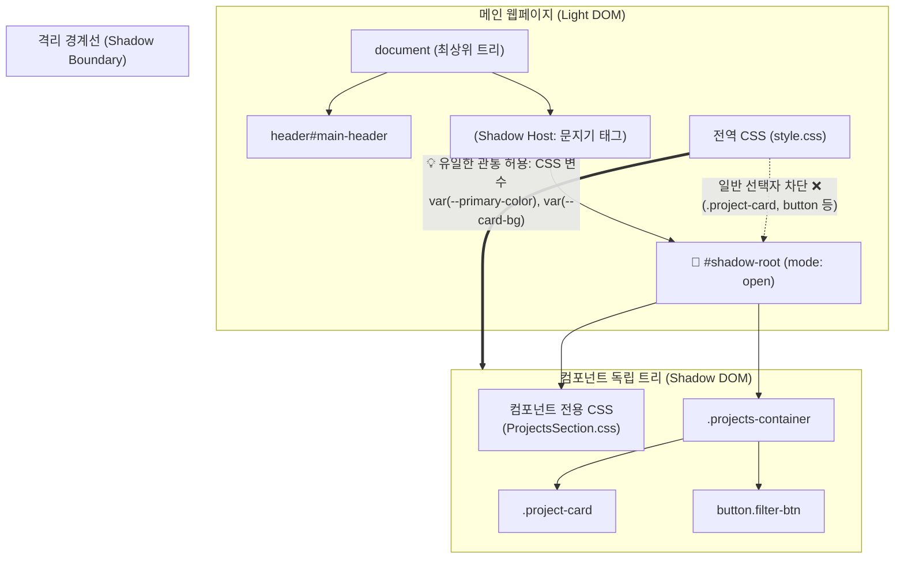

# Web Components 아키텍처 및 BaseComponent 설계

브라우저 표준 기술인 **Web Components**의 핵심 원리와, 리액트처럼 상태 기반 렌더링 및 라이프사이클을 지원하도록 구축한 **`BaseComponent` 추상 클래스 설계**를 정리한 문서입니다.

---

## 1. Web Components의 3대 핵심 표준

| 기술                          | 역할 및 설명                                                             |
| :---------------------------- | :----------------------------------------------------------------------- |
| **Custom Elements**           | HTML 표준에 없는 나만의 태그(예: `<hero-section>`)를 자바스크립트로 정의 |
| **Shadow DOM**                | 컴포넌트 내부의 DOM 트리와 스타일(CSS)을 외부와 완벽히 격리(캡슐화)      |
| **HTML Templates & `<slot>`** | 렌더링 시점에 원하는 위치에 콘텐츠를 투영(Slotting)하여 자식 요소를 주입 |

---

## 2. 웹 컴포넌트 필수 규칙

### ① HTMLElement 상속

모든 커스텀 엘리먼트는 브라우저 내장 클래스인 `HTMLElement`를 반드시 상속(`extends`)받아야 브라우저의 DOM 생명주기 메서드를 사용할 수 있습니다.

### ② Kebab-case 네이밍 규칙 (대시 `-` 필수)

- **HTML은 대소문자를 구분하지 않습니다**: `<HeroSection>`이라고 작성해도 브라우저는 소문자 `<herosection>`으로 파싱합니다.
- **미래의 공식 HTML 태그와의 충돌 방지**: W3C 웹 표준 기구는 공식 HTML 태그에 절대 대시(`-`)를 사용하지 않기로 약속했습니다. 따라서 커스텀 태그는 반드시 대시를 1개 이상 포함해야 합니다.
  - ❌ `customElements.define("herosection", HeroSection)` (에러)
  - ⭕ `customElements.define("hero-section", HeroSection)` (정상)

---

## 3. Shadow DOM과 스타일 캡슐화 (시각적 아키텍처)

Shadow DOM은 메인 웹페이지(Light DOM)와 컴포넌트 내부 사이에 **"보이지 않는 차단벽(Shadow Boundary)"**을 세워 완벽한 캡슐화(Encapsulation)를 보장합니다.

### 1) Light DOM vs Shadow DOM 구조 시각화



### 2) 왜 `this.attachShadow({ mode: "open" })`을 쓰는가?

| 비교 관점 | 일반 DOM (Light DOM) | 섀도우 돔 (Shadow DOM) |
| :--- | :--- | :--- |
| **CSS 스타일 범위** | **전역(Global)**: 클래스명이 겹치면 페이지 전체가 오염됨 | **지역(Scoped)**: 컴포넌트 내부 CSS는 절대 밖으로 새지 않음 |
| **외부 스타일 영향** | 부모/전역 스타일의 영향을 무조건 받음 | **원천 차단**: 전역 태그 선택자가 내부로 침투하지 못함 |
| **DOM 탐색 (`querySelector`)** | `document.querySelector('button')`으로 모두 잡힘 | 외부 `document` 탐색에서 제외되어 완벽히 은닉됨 |
| **예외 관통 규칙** | 해당 없음 | **CSS 변수(`var(--...)`)만 유일하게 경계를 뚫고 상속**됨 |

---

## 4. `BaseComponent` 추상 클래스 설계 원리

반복되는 웹 컴포넌트 보일러플레이트를 제거하고 일관된 컨벤션을 위해 설계된 부모 클래스입니다.

### 핵심 기능 매커니즘

1. **상태 관리 (`state` & `setState`)**:
   - `this.state` 변경 시 자동으로 `_renderWithStyle()`이 호출되어 화면을 다시 그립니다.
2. **1:1 CSS 파일 매핑 컨벤션**:
   - `BaseComponent.resolveCss("ComponentName.css")`를 통해 자식 클래스와 동일한 이름의 CSS 파일이 자동으로 링크됩니다.
3. **비동기 `mounted()` 라이프사이클 자동 감지**:
   - 자식 컴포넌트의 `mounted()`가 `Promise`(async)를 반환하면, 부모 클래스가 자동으로 `isLoading: true` 상태로 전환하여 **스켈레톤/스피너**를 띄우고, 완료 시 해제합니다.
4. **에러 바운더리(Error Boundary)**:
   - 비동기 통신 실패나 렌더링 에러 발생 시 컴포넌트가 깨지지 않고 공통 에러 박스(`renderError`)를 출력합니다.

```javascript
// BaseComponent.js 핵심 구조
export class BaseComponent extends HTMLElement {
  constructor() {
    super();
    this.attachShadow({ mode: "open" });
    this.state = { isLoading: false, error: null };
    this._isMounted = false;
  }

  connectedCallback() {
    this._renderWithStyle();
    if (!this._isMounted) {
      this._isMounted = true;
      this._handleMounted();
    }
  }

  async _handleMounted() {
    try {
      const result = this.mounted();
      if (result instanceof Promise) {
        this.setState({ isLoading: true, error: null });
    await result;
    this.setState({ isLoading: false });
  }

  // ⭐️ 성능 최적화: 스타일시트 최초 1회만 주입하여 FOUC 및 CSSOM 재파싱 방지
  _ensureStyles() {
    if (this._stylesInjected) return;
    this._stylesInjected = true;

    const baseLink = document.createElement("link");
    baseLink.rel = "stylesheet";
    baseLink.href = BaseComponent.resolveCss("BaseComponent.css");
    this.shadowRoot.appendChild(baseLink);

    if (this.cssPath) {
      const childLink = document.createElement("link");
      childLink.rel = "stylesheet";
      childLink.href = this.cssPath;
      this.shadowRoot.appendChild(childLink);
    }

    const container = document.createElement("div");
    container.className = "component-container";
    this.shadowRoot.appendChild(container);
  }

  _renderWithStyle() {
    this._ensureStyles();

    let html = "";
    if (this.state.error) html = this.renderError(this.state.error);
    else if (this.state.isLoading) html = this.renderLoading();
    else html = this.render();

    // 전체 ShadowRoot가 아닌 본문 컨테이너만 업데이트 (노드 파괴 방지)
    const container = this.shadowRoot.querySelector(".component-container");
    if (container) {
      container.innerHTML = html;
    }

    if (!this.state.isLoading && !this.state.error) {
      this.setEvents();
    }
  }
}
```

---

## 5. 컴포넌트 분리의 적정선 (과도한 분리 방지)

| 분류                       | 대상                                                                                                | 분리 판단 기준                                                                                                                 |
| :------------------------- | :-------------------------------------------------------------------------------------------------- | :----------------------------------------------------------------------------------------------------------------------------- |
| **분리 권장 (컴포넌트화)** | `ProjectsSection`, `ContactSection`                                                                 | **독립적인 상태(State), 비동기 API 통신, 사용자 입력 유효성 검사** 등 고유한 비즈니스 로직이 있을 때                           |
| **통합 권장 (단순화)**     | `GreetingsText`, `CtaButton` ➔ `HeroSection`                                                        | 특정 부모 안에서만 단 1회 쓰이거나 단순 래퍼일 때는 컴포넌트를 분리하지 않고 **부모 하나로 응집**시키는 것이 유지보수에 유리함 |
| **중복 래퍼 제거**         | `<section id="skills"><skills-section></section>` ➔ `<skills-section id="skills"></skills-section>` | 커스텀 엘리먼트 자체도 일반 DOM 노드이므로 직접 `id`와 `class`를 가질 수 있음                                                  |
