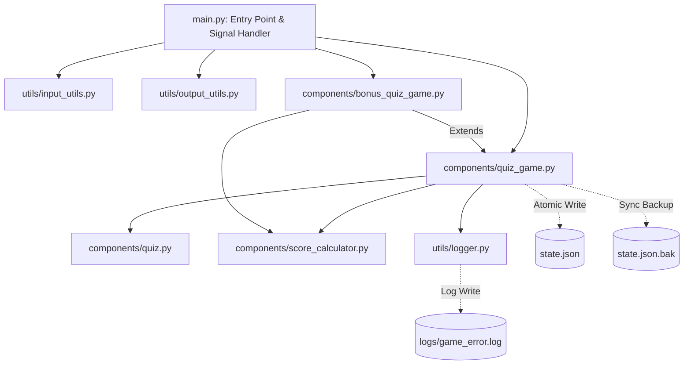
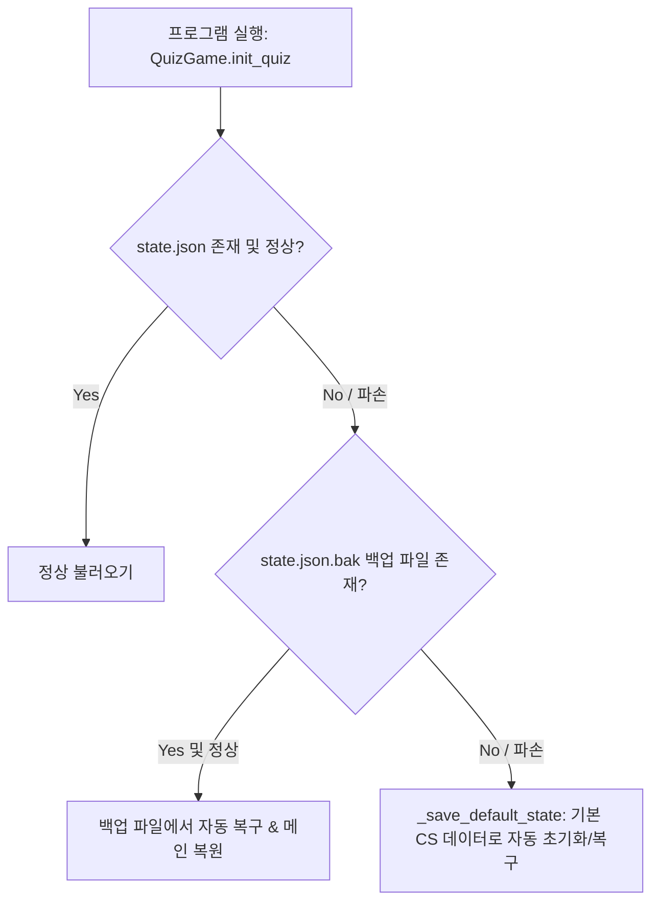

# 🎯 나만의 CS 퀴즈 게임 (Console Quiz Game)

> **Python 3.10+ 표준 라이브러리만을 활용하여 구축된 객체지향(OOP) 콘솔 퀴즈 게임 프로젝트**  
> 모듈화 패키지 아키텍처(Components & Utils), 데이터 영속성(JSON), 원자적 쓰기(Atomic Write), 예외 안전성 및 백업 복구 시스템을 탑재하였습니다.

---

## 📌 1. 프로젝트 개요

본 프로젝트는 Python 콘솔 기반의 인터랙티브 CS(Computer Science) 퀴즈 프로그램입니다.  
단순한 일회성 프로그램을 넘어, **단일 책임 원칙(SRP)**에 따른 모듈화 구조와 **원자적 데이터 영속성**을 제공하며 다음과 같은 기술적 특징을 가지고 있습니다.

- **외부 라이브러리 Zero (100% Standard Library)**: Python 3.10+ 순수 표준 라이브러리로만 구현
- **모듈화 아키텍처 (Layered Architecture)**:
  - 최상위 진입점: `main.py`
  - 도메인 logic 패키지: `components/` (`Quiz`, `QuizGame`, `BonusQuizGame`, `ScoreCalculator`)
  - 입출력 & 로깅 유틸리티 패키지: `utils/` (`InputUtils`, `OutputUtils`, `GameLogger`)
- **원자적 쓰기 (Atomic Write) & 백업 복구**:
  - `state.json.tmp` 임시 파일 선작성 후 `os.replace` 원자적 교체로 파일 손상 방지
  - 저장 시 `state.json.bak` 자동 동기화 백업 및 주 파일 손상 시 자동 복구
- **시그널 기반 안전 종료 (Signal Handling)**:
  - `SIGINT` (`Ctrl+C`), `SIGTERM` 수신 시 실행 중인 게임 상태를 자동 영속 저장 후 안전 종료

---

## 💡 2. 퀴즈 주제 및 선정 이유

- **주제**: CS (Computer Science) 기초 지식 (자료구조, 네트워크, DB, 운영체제, 알고리즘)
- **선정 이유**: 개발자 입문 과정에서 컴퓨터 과학 핵심 기본기를 점검하고 체화하는 것이 무엇보다 중요하다고 판단하여 선정하였습니다.

---

## 🚀 3. 실행 방법

### 1) 저장소 복제 및 디렉터리 이동

```bash
git clone https://github.com/Yoonsik-Shin/codyssey-mission.git
cd codyssey/E1/2   # 프로젝트 디렉터리로 이동
```

### 2) 프로그램 실행

```bash
python main.py
```

실행 시 게임 선택 메뉴가 표시됩니다:
1. **기본 퀴즈 게임**: 저장된 문제를 순서대로 출제하는 기본 게임 모드
2. **보너스 퀴즈 게임**: 문제 개수를 직접 선택하고 문제 순서를 **랜덤 출제**하는 확장 게임 모드

---

## ⚙️ 4. 주요 기능 명세

| 기능 항목             | 상세 설명                                                                                                                                                                                                               |
| --------------------- | ----------------------------------------------------------------------------------------------------------------------------------------------------------------------------------------------------------------------- |
| **🎯 퀴즈 풀기**      | - 저장된 CS 퀴즈를 출제하고 정/오답 판정 및 `ScoreCalculator` 기반 백분율 점수 계산<br>- 최고 점수 달성 시 자동 갱신 및 파일 저장<br>- **보너스 게임**: 원하는 문제 개수 선택, `random` 출제 및 **💡 힌트 보기(포인트 차감)** 지원 |
| **💡 힌트 & 포인트**  | - 보너스 게임 플레이 중 `5`번 입력 시 힌트를 조회하고 포인트(기본 1,000P) 차감 후 동일 문항 재입력 복귀                                                                                                                 |
| **📌 퀴즈 추가**      | - 문제 텍스트, 선택지 4개, 정답 번호, 카테고리, 난이도, 선택 힌트를 입력받아 새 퀴즈 추가<br>- 입력 직후 `state.json` 데이터 원자적 영속 반영                                                                           |
| **📋 퀴즈 목록**      | - 현재 등록되어 있는 전체 CS 퀴즈 문항 목록 (카테고리 및 난이도 포함) 확인                                                                                                                                               |
| **🗑️ 퀴즈 삭제**      | - 등록된 퀴즈 문항 목록을 확인하고, 삭제할 번호를 선택하여 즉시 삭제 및 `state.json` 반영                                                                                                                               |
| **🏆 점수 확인**      | - 저장된 최고 점수 및 당시 정답률(맞힌 문제 수 / 전체 문제 수) 확인                                                                                                                                                     |
| **📜 점수 히스토리**  | - 최근 완료한 모든 게임의 일시(`timestamp`), 푼 문제 수, 정답 수, 점수를 기록 및 조회                                                                                                                                   |
| **🛡️ 공통 예외 & 안전**| - `InputUtils.get_confirm_yes_no()`로 메뉴 종료 시 사용자 확인 절차 강화<br>- `SIGINT` / `SIGTERM` / `KeyboardInterrupt` 시 데이터 자동 영속 저장 후 안전 종료<br>- `state.json` 손상 시 `state.json.bak` 및 기본 CS 데이터로 자동 복구/초기화<br>- 예외 발생 시 `logs/game_error.log` 파일에 상세 트레이스백 기록 |

---

## 🏗️ 5. 파일 및 패키지 구조

### 📁 디렉터리 구조

```text
E1/2/
├── README.md               # 프로젝트 안내 및 상세 설계 문서
├── main.py                 # 프로그램 실행 진입점 및 Signal 핸들러
├── state.json              # 퀴즈 데이터 및 최고 점수 저장 JSON 파일 (Main)
├── state.json.bak          # 데이터 자동 백업 스냅샷 파일 (Backup)
├── logs/                   # 예외 로그 저장 디렉터리
│   └── game_error.log      # 시스템 에러 로그 파일
├── components/             # 퀴즈 도메인 및 게임 로직 패키지
│   ├── __init__.py         # 패키지 초기화 및 모듈 노출
│   ├── quiz.py             # 개별 퀴즈 모델 및 카테고리/난이도 속성을 정의하는 Quiz 클래스
│   ├── quiz_game.py        # 퀴즈 게임 메인 로직, 원자적 저장/복구를 관리하는 QuizGame 클래스
│   ├── bonus_quiz_game.py  # 힌트/포인트/삭제/랜덤출제를 지원하는 BonusQuizGame 클래스
│   └── score_calculator.py # 점수 계산 및 신기록 판단 책임을 담당하는 ScoreCalculator 클래스
└── utils/                  # 콘솔 입출력 및 로깅 유틸리티 패키지
    ├── __init__.py         # 패키지 초기화 및 모듈 노출
    ├── input_utils.py      # 입력 검증 및 사용자 확인(y/n)을 담당하는 InputUtils 클래스
    ├── output_utils.py     # 콘솔 1회 결합 출력을 담당하는 OutputUtils 클래스
    └── logger.py           # 예외 발생시 상세 트레이스백 기록을 담당하는 GameLogger 클래스
```

### 📐 계층 다이어그램 (Mermaid Architecture)



---

## 📐 6. 심층 기술 설계 문서 (Technical Deep-Dive)

### 6-1. 클래스 책임 분리 (Quiz vs QuizGame vs BonusQuizGame vs ScoreCalculator)

- **`Quiz` (단일 문항 모델)**:
  - **책임**: 문제 텍스트, 선택지, 정답 인덱스, 힌트 데이터, 카테고리, 난이도 등 개별 퀴즈 문항의 데이터와 정답 판단(`is_correct()`), 직렬화(`to_dict()`, `from_dict()`)를 캡슐화합니다.
  - **경계**: 게임 진행 상태나 전체 문제 목록, 파일 영속성에 대한 지식을 갖지 않으며 오직 1개 문제의 정답 판단에 집중합니다.
- **`QuizGame` (기본 게임 엔진 & 영속성 관리자)**:
  - **책임**: 전체 퀴즈 목록 리스트(`self.quizzes`) 관리, 표준 순차 게임 진행 흐름, 메인 데이터 영속화(`save_current_state()`), 손상 시 복구(`init_quiz()`) 및 Atomic Write를 전담합니다.
- **`BonusQuizGame` (다형성 기반 게임 확장)**:
  - **책임**: `QuizGame`을 상속받아 퀴즈 랜덤 출제(`random.sample`), 포인트/힌트 차감 시스템, 퀴즈 삭제(`remove_quiz()`) 등 확장 기능을 구현합니다.
- **`ScoreCalculator` (점수 계산 유틸리티)**:
  - **책임**: 백분율 점수 계산(`calculate_score()`), 최고 기록 초과 판단(`is_new_record()`)의 순수 계산 로직만을 캡슐화하여 도메인 게임 엔진과 계산 로직을 분리하였습니다.

---

### 6-2. 왜 클래스(OOP)인가? (함수형/절차적 코드 대비 장점)

1. **상태와 행위의 캡슐화 (Encapsulation)**:
   - `QuizGame` 객체 내부에서 `quizzes`, `best_state`, `game_histories`를 캡슐화하여 관리함으로써 전역 변수 오염 없이 안전하게 상태를 유지합니다.
2. **다형성을 통한 객체 확장성 (Polymorphism & Inheritance)**:
   - `BonusQuizGame`은 `QuizGame`을 상속받아 `choice_menu()`와 `start()` 메서드를 오버라이딩합니다. `main.py`는 동일한 인터페이스로 게임을 실행하므로 코드 변경을 최소화하면서 새로운 모드를 확장할 수 있습니다.
3. **단일 책임 원칙 (SRP) 및 재사용성**:
   - I/O 처리(`InputUtils`, `OutputUtils`), 예외 로깅(`GameLogger`), 점수 계산(`ScoreCalculator`), 데이터 모델(`Quiz`)을 각각 독립된 클래스로 작성하여 코드 유지보수성과 테스트 용이성을 극대화하였습니다.

---

### 6-3. JSON 데이터 포맷 채택 이유 및 특성 분석

- **채택 이유**:
  1. **텍스트 기반 높은 가독성**: 사람이 직관적으로 읽고 편집할 수 있어 디버깅 및 데이터 관리가 매우 용이함
  2. **Python 표준 라이브러리 100% 호환**: 추가 외부 의존성(PyYAML, SQLAlchemy 등) 없이 `json` 표준 모듈만으로 파싱/직렬화 가능
  3. **경량화 및 이식성**: 키-값 쌍과 리스트 구조를 그대로 표현하여 퀴즈 데이터 저장용으로 최적
- **제약사항 및 한계**:
  - 데이터 단위 부분 수정이 불가능하며 파일 전체를 다시 써야 함 (대규모 데이터 처리 시 I/O 병목 가능)
  - 파이썬 기본 데이터 구조 외의 복잡한 객체 상태 저장 시 직렬화/역직렬화 구현이 필요함

---

### 6-4. 데이터 원자성(Atomic Write) & 백업/복구 전략

#### 원자적 쓰기 (Atomic Write) 메커니즘
파일 쓰기 도중 정전이나 시스템 다운이 발생할 경우 `state.json`이 0바이트로 파손되는 문제를 방지하기 위해 다음과 같은 원자적 교체 전략을 적용했습니다.

1. 데이터를 임시 파일 `state.json.tmp`에 작성 후 `os.fsync()`로 디스크에 커밋
2. `os.replace(temp_file_path, file_path)` 명령을 호출하여 운영체제 커널 수준에서 원자적(Atomic) 파일 교체 수행
3. 쓰기 완료 직후 `shutil.copy2`를 실행하여 백업 파일 `state.json.bak` 동기화 생성

#### 자동 복구 (Auto Recovery) 수명주기


---

### 6-5. 대규모 퀴즈 데이터 확장 시 (1,000개+) 성능 분석 및 대안

현재 구현 방식은 `state.json` 파일 전체를 메모리에 로드하여 처리하는 구조입니다.

#### 성능 한계 분석
1. **메모리 오버헤드**: 퀴즈가 1,000개~10,000개 이상 누적될 경우 모든 객체를 메모리에 올리는 과정에서 RAM 사용량 급증
2. **I/O 병목**: 단 1개의 퀴즈 추가/삭제 시에도 전체 퀴즈 목록을 파일에 새로 써야 하므로 Disk Write 병목 발생
3. **검색 및 필터링 성능**: 특정 카테고리나 난이도별 퀴즈 조회 시 전수 조사(O(N)) 방식 사용으로 지연 발생

#### 기술적 대안 및 확장 로드맵
- **Relational Database (SQLite / PostgreSQL)**:
  - 표준 라이브러리 `sqlite3`를 도입하여 RDBMS로 전환.
  - `quizzes` 테이블을 생성하고 `category`, `difficulty` 인덱스를 추가하여 `SELECT * FROM quizzes WHERE category = 'CS'` 와 같이 O(1)~O(log N) 조회 지원.
  - 트랜잭션(ACID) 지원으로 데이터 일관성과 쓰기 성능 확보.
- **검색 엔진 / 인덱싱 (Elasticsearch / In-Memory Index)**:
  - 퀴즈 문항 키워드 검색 지원을 위한 역색인(Inverted Index) 아키텍처 도입.

---

### 6-6. Git 브랜치 전략 및 커밋 규약 (Git Workflow)

#### 브랜치 전략 (Git Flow / GitHub Flow)
- `master` (`main`): 프로덕션 출시용 안정 버전 브랜치
- `feature/*`: 신규 기능 개발 및 버그 수정 전용 작업 브랜치 (예: `feature/E1-2-enhancement`)
- **병합 정책**: 병합 시 히스토리 추적이 가능하도록 Non-fast-forward merge (`git merge --no-ff`) 사용

#### Conventional Commits 커밋 규약
본 프로젝트는 세분화된 커밋 히스토리를 관리를 위해 다음과 같은 규약을 준수합니다.

- **포맷**: `<Type>: <Subject>`
- **타입 종류**:
  - `Feat`: 새로운 기능 추가
  - `Fix`: 버그 및 예외 수정
  - `Refactor`: 코드 구조 개선 및 책임 분리 (기능 변경 없음)
  - `Docs`: README 및 기술 문서 수정
  - `Chore`: 설정 파일 및 빌드 관련 수정
- **커밋 예시**:
  - `Feat: Add category, difficulty metadata and serialization methods to Quiz`
  - `Refactor: Add GameLogger and ScoreCalculator to decouple concerns`

---

## 💾 7. 데이터 스키마 (`state.json`)

```json
{
    "schemaVersion": "1.0.0",
    "quizzes": [
        {
            "question": "LIFO(Last-In, First-Out) 특징을 가지는 자료구조는 무엇인가?",
            "choices": [
                "큐 (Queue)",
                "스택 (Stack)",
                "트리 (Tree)",
                "그래프 (Graph)"
            ],
            "answer": 1,
            "hint_data": {
                "sentence": "입력된 순서의 반대로 출력되는 후입선출 자료구조입니다.",
                "cost": 100
            },
            "category": "Data Structure",
            "difficulty": "Easy"
        }
    ],
    "bestState": {
        "score": 100,
        "correct": 6,
        "total": 6
    },
    "gameHistories": [
        {
            "timestamp": "2026-08-07 08:39:34",
            "total_quiz_count": 5,
            "correct_quiz_count": 4,
            "score": 80
        }
    ]
}
```

---

## 📜 8. Git 원격 저장소 및 커밋 히스토리 증빙 (Git Log)

- **원격 저장소 URL**: `https://github.com/Yoonsik-Shin/codyssey-mission.git`
- **커밋 그래프 및 병합 이력 (10건 이상)**:

```text
*   [feature/E1-2-enhancement] Chore: Update state.json schema with schemaVersion, category and difficulty fields
*   Feat: Implement signal handlers (SIGINT/SIGTERM) and exit confirmation UX in main.py
*   Feat: Add Atomic write, backup recovery, logging and schema versioning to QuizGame
*   Feat: Add get_confirm_yes_no and standardize input error messages
*   Feat: Add category, difficulty metadata and serialization methods to Quiz
*   Refactor: Add GameLogger and ScoreCalculator to decouple concerns
*   Merge pull request #2 from Yoonsik-Shin/feature-E1-2
|\  
| * Fix: state.json 내 퀴즈 힌트 데이터(hint_data) 갱신 및 정상 작성
| * Fix: 하위 클래스(BonusQuizGame)에서 init_quiz() 호출 시 다형성 인스턴스가 생성되도록 @classmethod(cls)로 변경
| * Style: 터미널 단일 기본 텍스트 색상(Plain monochrome)으로 스크린샷 4종 갱신
| * Docs: 과제 제출용 실행 화면 스크린샷 4종(menu, play, add_quiz, score) 생성 및 README 반영
| * Chore: .gitignore 생성 및 __pycache__ 파이썬 캐시 파일 추적 제외
| * Merge branch 'docs/readme-final' into feature-E1-2
| * Docs: README.md 개요, 실행 방법, 패키지 구조, 기능 목록 및 state.json 스키마 명세 작성
```

---

## 📷 9. 실행 화면 스크린샷

|         메뉴 화면 (`menu.png`)          |         퀴즈 풀기 (`play.png`)          |
| :-------------------------------------: | :-------------------------------------: |
|  |  |

|         퀴즈 추가 (`add_quiz.png`)          |         점수 및 히스토리 (`score.png`)          |
| :-----------------------------------------: | :---------------------------------------------: |
|  |  |
