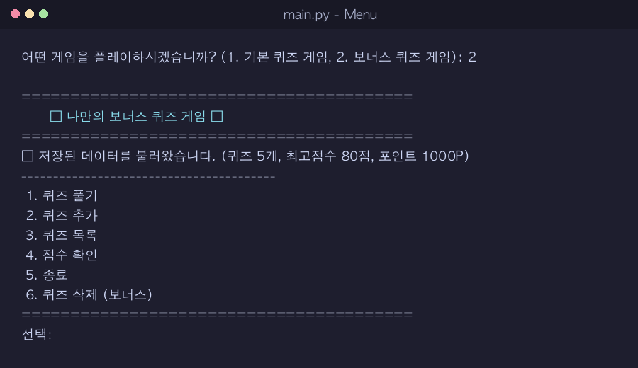
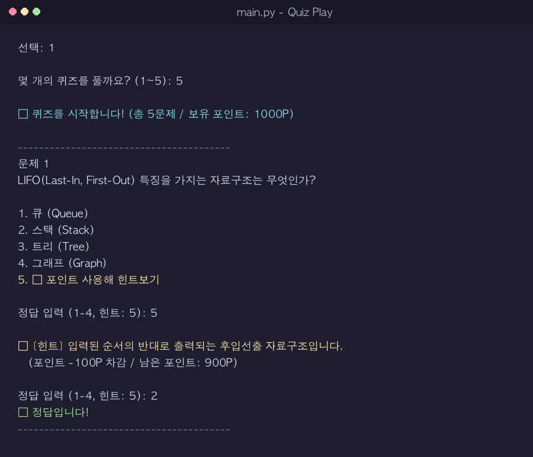
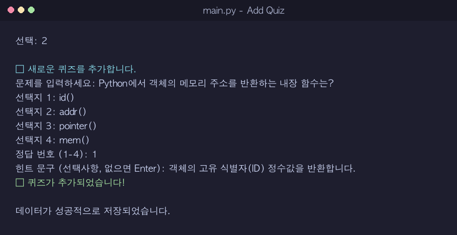
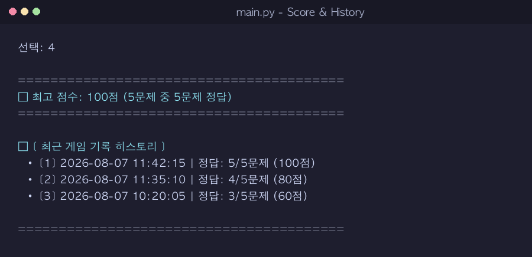

# 🎯 나만의 CS 퀴즈 게임 (Console Quiz Game)

> **Python 3.10+ 표준 라이브러리만을 활용하여 구축된 객체지향(OOP) 콘솔 퀴즈 게임 프로젝트**  
> 모듈화 패키지 아키텍처(Components & Utils), 데이터 영속성(JSON), I/O 렌더링 최적화, 예외 안전성을 탑재하였습니다.

---

## 📌 1. 프로젝트 개요

본 프로젝트는 Python 콘솔 기반의 인터랙티브 CS(Computer Science) 퀴즈 프로그램입니다.  
단순한 일회성 프로그램을 넘어, **단일 책임 원칙(SRP)**에 따른 모듈화 구조와 **데이터 영속성**을 제공하며 다음과 같은 기술적 특징을 가지고 있습니다.

* **외부 라이브러리 Zero (100% Standard Library)**: Python 3.10+ 순수 표준 라이브러리로만 구현
* **모듈화 아키텍처 (Layered Architecture)**: 
  * 최상위 진입점: `main.py`
  * 도메인 logic 패키지: `components/` (`Quiz`, `QuizGame`, `BonusQuizGame`)
  * 입출력 유틸리티 패키지: `utils/` (`InputUtils`, `OutputUtils`)
* **I/O 렌더링 최적화**: 콘솔 출력을 1회 문자열 결합(`\n.join`) 후 단 1회 버퍼 출력하여 콘솔 I/O 시스템 콜 오버헤드 최소화
* **강력한 데이터 영속성 & 자동 복구**: `state.json`을 통해 퀴즈 목록과 최고 점수를 유지하며, 파일 손상 시 기본 데이터로 자동 초기화/복구

---

## 💡 2. 퀴즈 주제 및 선정 이유

* **주제**: CS (Computer Science) 기초 지식 (자료구조, 네트워크, DB, 운영체제, 알고리즘)
* **선정 이유**: 개발자 입문 과정에서 컴퓨터 과학 핵심 기본기를 점검하고 체화하는 것이 무엇보다 중요하다고 판단하여 선정하였습니다.

---

## 🚀 3. 실행 방법

### 1) 저장소 복제 및 디렉터리 이동

```bash
git clone <저장소-URL>
cd codyssey/E1/2   # 프로젝트 디렉터리로 이동
```

### 2) 프로그램 실행

```bash
python main.py
```

실행 시 게임 선택 메뉴가 표시됩니다:
1. **기본 퀴즈 게임**: 저장된 문제를 순서대로 출제하는 기본 게임 모드
2. **보너스 퀴즈 게임**: 문제 개수를 직접 선택하고 문제 순서를 **랜덤 출제**하는 확장 게임 모드

---

## ⚙️ 4. 주요 기능 명세

| 기능 항목 | 상세 설명 |
|---|---|
| **🎯 퀴즈 풀기** | - 저장된 CS 퀴즈를 출제하고 정/오답 판정 및 백분율 점수 계산<br>- 최고 점수 달성 시 자동 갱신 및 파일 저장<br>- **보너스 게임**: 원하는 문제 개수 선택, `random` 출제 및 **💡 힌트 보기(포인트 차감)** 지원 |
| **💡 힌트 & 포인트** | - 보너스 게임 플레이 중 `5`번 입력 시 힌트를 조회하고 포인트(기본 1,000P) 차감 후 동일 문항 재입력 복귀 |
| **📌 퀴즈 추가** | - 문제 텍스트, 선택지 4개, 정답 번호, 선택 힌트를 입력받아 새 퀴즈 추가<br>- 입력 직후 `state.json` 데이터 영속 반영 |
| **📋 퀴즈 목록** | - 현재 등록되어 있는 전체 CS 퀴즈 문항 목록 확인 |
| **🗑️ 퀴즈 삭제** | - 등록된 퀴즈 문항 목록을 확인하고, 삭제할 번호를 선택하여 즉시 삭제 및 `state.json` 반영 |
| **🏆 점수 확인** | - 저장된 최고 점수 및 당시 정답률(맞힌 문제 수 / 전체 문제 수) 확인 |
| **📜 점수 히스토리** | - 최근 완료한 모든 게임의 일시(`timestamp`), 푼 문제 수, 정답 수, 점수를 기록 및 조회 |
| **🛡️ 공통 예외 처리** | - 문자열 입력, 범위 밖 숫자, 빈 입력(Enter) 시 재입력 흐름 보장<br>- `Ctrl+C` (`KeyboardInterrupt`) / `EOFError` 시 데이터 안전 저장 후 안전 종료<br>- `state.json` 손상 또는 부재 시 기본 CS 데이터로 자동 복구/초기화 |

---

## 🏗️ 5. 파일 및 패키지 구조

### 📁 디렉터리 트러스트 구조

```text
E1/2/
├── README.md               # 프로젝트 안내 및 기능 명세 문서
├── main.py                 # 프로그램 실행 진입점 (최상위 소스 파일)
├── state.json              # 퀴즈 데이터 및 최고 점수 저장 JSON 파일
├── components/             # 퀴즈 도메인 및 게임 로직 패키지
│   ├── __init__.py         # 패키지 초기화 및 모듈 노출
│   ├── quiz.py             # 개별 퀴즈 모델을 정의하는 Quiz 클래스
│   ├── quiz_game.py        # 퀴즈 게임 메인 로직 및 영속성을 관리하는 QuizGame 클래스
│   └── bonus_quiz_game.py  # 랜덤 출제 및 문제 수 선택을 지원하는 BonusQuizGame 클래스
└── utils/                  # 콘솔 입출력 유틸리티 패키지
    ├── __init__.py         # 패키지 초기화 및 모듈 노출
    ├── input_utils.py      # 공통 입력 검증 및 예외 처리를 담당하는 InputUtils 클래스
    └── output_utils.py     # 콘솔 1회 결합 출력을 담당하는 OutputUtils 클래스
```

---

## 💾 6. 데이터 파일 설명 (`state.json`)

* **파일 경로**: `E1/2/state.json` (프로젝트 루트)
* **인코딩**: UTF-8
* **역할**: 등록된 퀴즈 목록과 사용자의 최고 점수 데이터를 영속적으로 저장

### 📄 데이터 필드 구조 (Schema)

```json
{
  "quizzes": [
    {
      "question": "LIFO(Last-In, First-Out) 특징을 가지는 자료구조는 무엇인가?",
      "choices": [
        "큐 (Queue)",
        "스택 (Stack)",
        "트리 (Tree)",
        "그래프 (Graph)"
      ],
      "answer": 1
    }
  ],
  "bestState": {
    "score": 100,
    "correct": 6,
    "total": 6
  },
  "gameHistories": [
    {
      "timestamp": "2026-08-07 08:39:34",
      "total_quiz_count": 5,
      "correct_quiz_count": 4,
      "score": 80
    }
  ]
}
```

#### 필드 명세
* **`quizzes`** (`list[dict]`): 등록된 퀴즈 객체 리스트
  * `question` (`str`): 퀴즈 문제 텍스트
  * `choices` (`list[str]`): 4개의 선택지 리스트
  * `answer` (`int`): 정답 인덱스 (0-based)
  * `hint_data` (`dict`, optional): 힌트 문구(`sentence`) 및 필요 포인트(`cost`) 정보
* **`bestState`** (`dict`): 최고 점수 기록 정보
  * `score` (`int`): 백분율 기준 최고 점수 (0~100)
  * `correct` (`int`): 최고 점수 기록 시 맞힌 문제 수
  * `total` (`int`): 최고 점수 기록 시 전체 문제 수
* **`gameHistories`** (`list[dict]`): 플레이된 모든 게임 기록 목록
  * `timestamp` (`str`): 게임 플레이 일시 (`YYYY-MM-DD HH:MM:SS`)
  * `total_quiz_count` (`int`): 푼 문제 수
  * `correct_quiz_count` (`int`): 맞힌 문제 수
  * `score` (`int`): 백분율 기준 획득 점수 (0~100)

---

## 📷 7. 실행 화면 스크린샷

| 메뉴 화면 (`menu.png`) | 퀴즈 풀기 (`play.png`) |
|:---:|:---:|
|  |  |

| 퀴즈 추가 (`add_quiz.png`) | 점수 및 히스토리 (`score.png`) |
|:---:|:---:|
|  |  |
